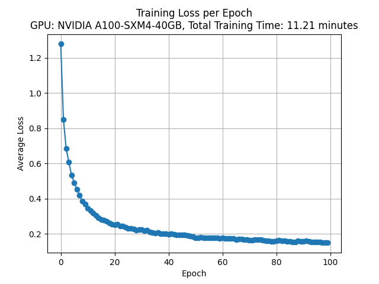
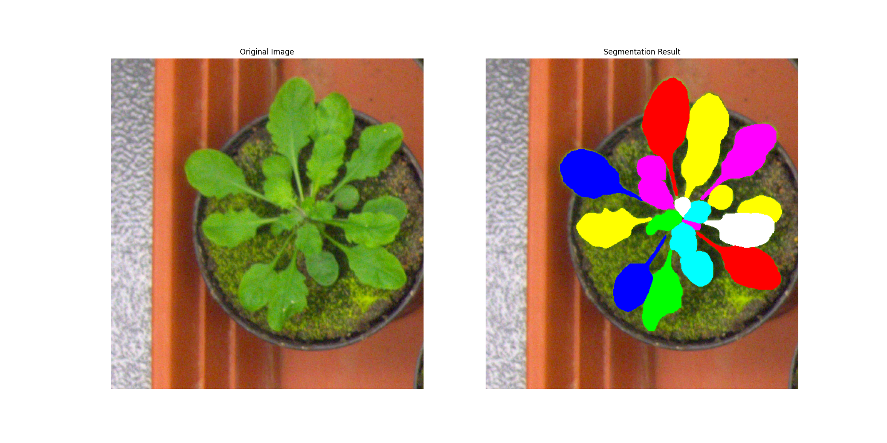

# NTTU-ML2024-LeafSegmentation

本專案是臺東大學 2024 年機器學習課程的第四次作業，目標是訓練深度學習模型進行葉子分割。此專案展示了如何使用深度學習技術精確識別和分割圖像中的葉子。

## 專案介紹

在本專案中，我使用了 Mask R-CNN 模型，該模型不僅能夠識別圖像中的葉子，還能生成每片葉子的像素級分割掩膜。我選用了 ResNet50 作為模型的骨幹網絡，並使用特徵金字塔網絡（FPN）來增強特徵表示。整個訓練過程在 Google Colab 上進行，使用了 NVIDIA A100 GPU 來進行模型訓練。

### 訓練原因

選擇訓練這個模型的原因如下：
- **精確定位和測量**：獲得每片葉子的精確位置和形狀，進行面積、周長等測量。
- **疾病檢測和診斷**：在農業應用中，檢測葉子上的病變區域，進行病害診斷。
- **生長分析**：分析植物的生長狀況，計算葉子的數量和大小變化。
- **自動化處理**：提高效率，替代人工標註，節省時間和人力成本。

## 訓練結果

### Loss 變化圖

### 分割結果展示

## 使用方法

### 使用訓練的模型

1. 載入模型。
   訓練過後的模型位於 ！[雲端硬碟](https://drive.google.com/file/d/1-0AgDn0SBEjls0VmpBleab3EBFzn9vwa/view?usp=sharing)
2. 執行「訓練模型」區塊上方的部分。

### 訓練模型

執行「訓練模型」區塊下方的部分。

### 保存模型

執行「保存模型和訓練損失圖表」下方的部分。

## 結論

通過本專案的實踐，我們成功地訓練了一個能夠精確識別和分割葉子的 Mask R-CNN 模型，這對於進一步的數據分析和應用非常重要。感謝臺東大學 2024 年機器學習課程提供的學習機會和資源支持。